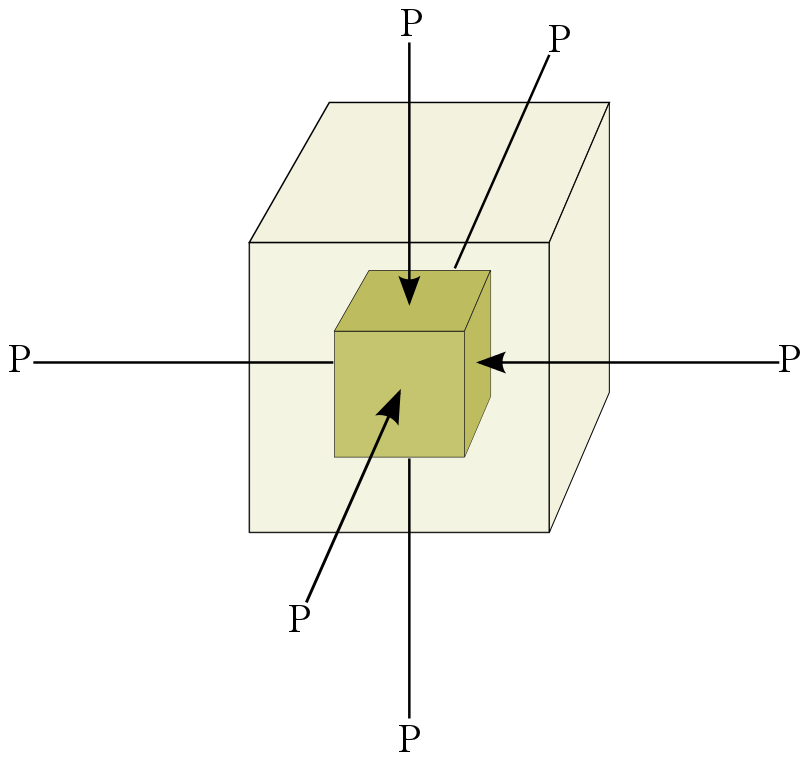

.. _seismic_fundamental_physics:

Fundamental physics
*******************

Fundamental Physics of Seismology
=================================

If we strike the earth with a hammer, an explosive charge, or an earthquake,
the material of the earth near the source becomes compressed (or extended) and
twisted. Earth materials are elastic and these deformations propagate away
from the source. The speed of propagation and the type of motion propagated
depends upon the elastic properties of the material, namely

1. density: \\( \\rho \\)
2. bulk modulus:  \\( \\kappa \\) (compressibility)
3. shear modulus:  \\( \\mu \\) (twistability)

By knowing the time at which the source occurred, and by measuring the travel
time that it takes for the various waves to arrive at a receiver, it is
possible to obtain information about the velocity and density of the material.
This information is then used to provide information about structure and rock
type.

Applications of Seismic Surveying
=================================

1. delineation of sedimentary layers
2. determination of depth to bedrock, and topography of the
3. bedrock horizon
4. locating faults
5. large scale structure of earth (using earthquakes)
6. characterization of near surface material properties.

Stress
======

.. sidebar:: Compressive and Tensile Stress

	.. figure:: images/compressive.png
		:align: center

	.. figure:: images/tensile.png
		:align: center

When an external force is applied to a body, there are balanced internal
forces set up within the body. Stress is a measure of these internal forces.
Units are "force per unit area" or N/m\\(^2\\) . There are two types of
stress:

Stress can be **normal** to the surface it is applied on, and hence
**compressive** or **tensile**.

Stress can be **parallel** to the surface. This is **shear** stress (bottom
figure)

Strain
======

If a body is stressed it will undergo a change in size and shape. The body is
**strained**. If the strains are small then the body will recover its original
shape when the stress is removed. This is **elastic strain**. If the strain is
too great so that the **yield strength** is exceeded, then the body deforms
**plastically** and may ultimately fracture. Plastic strain is not
recoverable.

The figure plots how strain (horizontal axis) accumulates as stress (vertical
axis) is applied. While behaviour is elastic, increasing or decreasing the
stress does nothing to change the material. Once stress is sufficient to make
material behave plastically, reducing the stress results in reduced strain
along a different path on the graph. Once the fracture point is reached, the
strain is released by breaking.

.. figure :: ./images/stressstrain.png
	:align: center
	:scale: 80 %

Elastic Moduli
==============

The linear relationship between stress and strain is known as Hooke's Law and
is specified by five elastic moduli or elastic constants which express the
ratio of a particular stress to a resultant strain. Four important constants
are explained briefly next. Elastic constants are defined in SubSurfWiki_

.. _SubSurfWiki: http://www.subsurfwiki.org/wiki/Elastic_modulus

Young's Modulus
---------------

Consider a rod (figure right) of length l, cross-sectional area \\(A\\), to
which a uniform force \\(F\\) is applied to each end (a tensional force in
this case): Young's modulus, \\(E\\), is given by

.. math::
	E = \frac{\text{longitudinal stress}~ (F/A)}{\text{longitudinal strain} ~(\Delta l/l)}

.. figure:: ./images/youngs.png
		:align: center
		:scale: 60%

Poisson's Ratio
---------------

The rod will also contract in radius (because it is being extended). The
radial strain is \\(\\Delta r / r\\). **Poisson's ratio** is given by

.. math::
	\sigma = \frac{\text{lateral strain} ~(\Delta r / r)}{\text{longitudinal strain}~ (\Delta l/l)}

Bulk Modulus
------------

Consider an initial volume \\(V\\) which is subjected to a hydrostatic
pressure (force per unit area is the same in each direction). Let \\(\\Delta
V\\) be the change in volume. The **bulk modulus** is

.. math::
	\kappa = \frac{\text{Pressure (volumetric stress)} ~ P}{\text{volumetric strain} ~ (\Delta V/V)}

Shear Modulus
-------------

If we apply a force parallel to a surface the force per unit area is known as
the shear stress \\( \\tau \\) . Consider a rectangular cube. Application of
shear stresses to the top and bottom interfaces produce a strain proportional
to \\(\\tan \\theta\\). The **shear modulus** is

.. figure:: ./images/shearmodulus.png
	:align: center
	:scale: 70 %

.. math::
	\mu = \frac{\text{shear stress} ~ \tau}{\text{shear strain} ~ \tan\theta}

Elastic model for the Earth rocks
=================================

Earth materials are **elastic**. The easiest way to obtain intuition is to
think about rocks as being made up of a set of connected springs. Apply a
force (stress) to any part and you will eventually get motion elsewhere. There
are two general types of waves that can travel in the elastic material.

.. sidebar:: Elastic model for rocks

	.. figure:: ./images/springbox.png
		:align: center

1. **Body waves** which travel through materials

2. **Surface waves** which travel only along boundaries between materials such
   as the ground / air boundary.

Specific types of waves within these general types are described below. Each
wave type travels with a velocity that depends upon the elastic properties.

Body Waves
==========

**Compressional waves (P waves)** propagate by compression and rarefaction, and
the velocity of such waves, \\(v_p\\) is given in terms of elastic moduli
introduced above and density \\( \\rho \\), by the equation shown here

.. math::
	v_p = \sqrt{ \frac{\kappa + 4/3\mu}{\rho} }

.. figure:: ./images/pwaves.gif
	:align: center

**Shear waves (S waves)** propagate by a pure shear strain perpendicular to the
wave propagation. There are two planes of polarization. SV and SH waves
travel at the same speed, \\(v_s\\) , which is given in terms of elastic
moduli introduced above and density \\(\\rho \\) ,

.. math ::
	v_s = \sqrt{\frac{\mu}{\rho} }

.. figure:: ./images/swaves.gif
	:align: center

Note that if \\(\\mu = 0 \\) then \\(v_s = 0 \\). This tells us that shear
waves do not travel in a liquid.

Seismic reflection and refraction surveying is usually carried out by
observing how P-waves travel, reflect, and refract within the geologic layers
near the surface. We will see that the energy is generated by an artificial
source. S-waves can also be used, but they are a little harder to generate
artificially (compared to P-waves), and require special ground motion sensors.
However, since \\(v_s < v_p\\), there are situations where it is beneficial to
use S-waves instead of P-waves.

Surface Waves
=============

**Rayleigh waves** propagate along a free surface or on the boundary between two
materials. Particle motion is a retrograde ellipse, and in the same plane as
wave energy propagation. The amplitude of particle motion decays
exponentially with depth. Rayleigh wave speed \\( v_R < v_S \\). Large
earthquakes can generate Rayleigh waves that circumnavigate the globe. This
provides information about the velocity structure in the upper few hundred
kilometers of the earth.

.. figure:: ./images/rayleigh.gif
	:align: center

**Love waves** exist in a surface layer when the shear wave velocity of the
upper layer is less than the shear wave velocity of the lower layer. The
waves are trapped in the upper layer and the particle motion is parallel to
the free surface and perpendicular to the direction of propagation.

.. math::
	v_{S1} < v_{Love} < v_{S2}

.. figure:: ./images/love.gif
	:align: center

Both Love waves and Rayleigh waves are **dispersive**. That is, different
frequency components travel at different speeds. So the wave changes shape as
it travels. Also, the dispersion can be used to provide information about the
velocity structure in the upper region of the earth. For shallow work, it is
possible to generate surface waves artificially, and then observe the waves at
a series of locations at increasing distances from the source. This type of
field work is sometimes called **multi-channel analysis of surface waves** or
MASW. This is usually considered an "advanced" topic in applied geophysics.

Waves and Rays
==============

A wavefront indicates the locations at which the phase of the wave has the
same value. For example, visualize the peaks (or troughs) of water ripples
after a rock has been thrown in. The direction of propagation of the energy is
normal to the wavefront. **Seismic rays** are imaginary lines perpendicular to
the wavefront that indicate the path along which the wavefront is traveling.
Rays are not physical entities. They exist only to illustrate where the energy
travels.

.. figure:: ./images/wavefront.gif
	:align: center

Wave Velocity and Particle Velocity
===================================

Seismic waves typically travel in the ground at 2-7 km/s. This is the velocity
at which the energy moves, not the particles themselves. For comparison, sound
travels in air at approximately 0.33 km/s. The wave energy can be recorded
many kilometers from the source even if the source is small. The velocity and
displacements of individual particles in the rocks are however very small;
typical particle speeds are \\(10^{-8}\\) m/s and typical ground displacements
are \\(10^{-10}\\) m.

P-wave velocity of earth materials
==================================

Some characteristics of P-wave velocities are:

1. \\(v_p\\) increases with confining pressure;

2. sandstones and shales show a systematic increase in \\(v_p\\) with depth of burial and age (progressive compaction and cementation);

3. For a wide range of rocks there is an approximate relationship between density and \\(v_p\\);

4. The presence of gas in sedimentary rocks reduces the elastic moduli, Poisson's ratio, and the ratio \\(v_p / v_s\\).

Attenuation
===========

The amplitude of seismic waves falls off with distance from the source. There are two primary reasons:

1. Geometrical spreading - that is, energy falls off as 1/r2 and hence the amplitude falls of as 1/r.

2. Earth materials are not perfectly elastic. Some frictional heating occurs
   as the waves propagate through the earth. This is often described as
   "absorption" and the absorption coefficient expresses the proportion of energy
   lost as the wave travels a distance of one wavelength. The figure here shows
   the progressive change of shape of an original spike pulse during its
   propagation through the ground due to the effects of absorption (After Anstey
   1977.) The spike's shape changes as well as experiencing reduced amplitude.
   This is because the different frequencies making up the pulse decay at
   different rates - in fact, higher frequencies decay more rapidly than lower
   frequencies. This is easily observed on earthquake signals that have been
   recorded at different locations. As noted above in the context of surface
   waves, such frequency dependent behavior is called **dispersion**.

.. figure:: ./images/attenuation.gif
	:align: center
