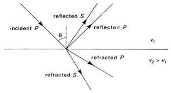

.. _seismic_ray_paths:

Ray Paths in Layered Media
**************************

Reflections and refractions at a plane interface
================================================

Consider a P-wave which is incident at an  angle :math:`\theta_1` measured with
respect to the normal of the interface. There will be a reflected wave and a
transmitted wave but the directions of the waves are given by the diagram to
the right.

**Law of reflection:** The angle of reflection equals the angle of incidence. So
:math:`\theta_r` = :math:`\theta_1` .

**Law of refraction:** The angle of refraction :math:`\theta_2`  is determined
through Snell's Law, which is

.. math::
	\frac{\sin\theta_1}{v_1} = \frac{\sin\theta_2}{v_2}

If the wave travels from a low velocity medium to a high velocity medium the
wave gets refracted away from the normal. Conversely, it gets refracted toward
the normal if the wave goes from a high velocity to a low velocity medium.

.. figure:: ./images/snell.gif
	:align: center

**"Critical refraction"** is an important concept in refraction seismics. The
"maximum value of :math:`\theta_2` is 90:math:`^\circ`. If this is the case,
"then refracted waves travel horizontally in the second medium. The incident
"angle that causes this, known as the critical angle, :math:`\theta_c` is
"found using Snell's law as follows:

.. math::
	\frac{\sin\theta_c}{v_1} = \frac{\sin 90^{\circ}}{v_2} = \frac{1}{v_2}

	\sin\theta_c = \frac{v_1}{v_2}

When the wave in the second medium is critically refracted, it travels
parallel to the interface at a speed of :math:`v_2`. As it travels, it radiates
energy into the upper medium with the associated ray path making an angle
:math:`\theta_c` with the normal. This critically refracted wave is also called
a "head wave". It is somewhat analogous to the bow wave of a moving boat.

.. figure:: ./images/criticalrefraction.gif
	:align: center

Mode Conversion
===============

A P-wave incident upon a boundary can produce reflected and transmitted
P-waves, but reflected and transmitted S-waves can also be produced. Analogous
conversions occur when there is an incident S wave on a plane boundary. The
mode conversions (P :math:`\rightarrow` S, or S :math:`\rightarrow` P) can
complicate interpretation, but S-waves are always slower than P-waves, so
first arrivals will always be P-waves unless a special S-wave energy source is
used. A valuable benefit of using shear waves is that they provide important
information about the rigidity of the material.

Waves for a layer over a halfspace
==================================

We do seismic refraction surveys in order to learn about the geometry of
geologic layers and velocities (ie. types of) materials. To do this we must
build relations relating what we know, and can measure, to the things we want.
In other words we must build equations that relate what we want (depths and
velocities) to what we measure (source-receiver distance and travel times).

Consider a layer of thickness h and velocity :math:`v_1` overlying a uniform
halfspace of velocity :math:`v_2`. A source is detonated at time :math:`t=0`. We
are interested in the waves and arrival times of those waves at a receiver
which is located a distance :math:`x` from the source at position :math:`D` in the
figure below.

There are three principle waves that will travel through the earth and arrive
at position D.   i) direct waves, ii) reflected waves, and  iii) critically
refracted waves.

.. figure:: ./images/waveslayerhalfspace.gif
	:align: center

.. <<editorial comment>> This diagram is ok. If redrawn, put a source symbol (*) and a dashed line for the critically refracted ray.

The travel time curves for these ray paths are shown to the right, and
expressions for the ray paths and important parameters of these travel time
curves are as follows:

- :math:`x_{crit}`  is the critical distance at which the refracted arrival first arrives.

- :math:`x_{cross}`  is the crossover distance. Beyond this distance the refracted arrival is the first arrival on the record.

- Travel times of visible arrivals are related to distance between geophone
  and source (:math:`x`), thickness of the layer (:math:`h`) and the velocities of
  signals within the two layers (:math:`v_1` and :math:`v_2`). Three times are of
  interest: :math:`t_{dir}` is travel time of direct arrivals, :math:`t_{ref}` is
  arrival time of reflections and :math:`t_{cr}` is the refraction travel time
  (see figure above). These parameters are all related as follows:

.. figure:: ./images/timetravels.gif
	:align: center

.. math::
	t_{dir} & = \frac{x}{v_1}\
	t_{ref} & = \frac{\sqrt{x^2 + 4h^2}}{v_1}\
	t_{cr}  & = \frac{x}{v_2} + \frac{2h\sqrt{v_2^2-v_1^2}}{v_1 v_2}

The first and third of these are important for interpretation of seismic
refraction data, and the next page explains how they arise, and how they are
used with refraction data on a T-X plot to obtain useful geological
information.
