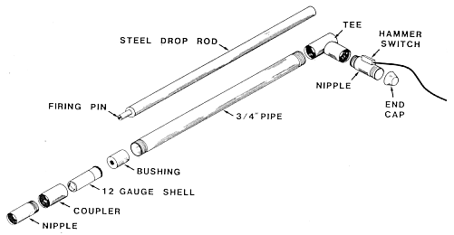
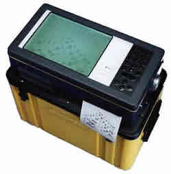

.. _seismic_sources:

Seismic Sources
***************

For seismic surveying purposes there are a number of generic goals. Not all of these objectives can be met perfectly, but sources are designed to meet them as effectively as possible.

1. High energy is required - the stronger the source, the better the signal to noise ratio.
2. High frequency is preferred - the higher the frequency, the shorter the seismic pulse and hence the better the resolution.
3. Repeatability is important for reliable measurements - we often want to stack the signals to improve the signal to noise ratio so repeat "shots" must all have identical source energy characteristics.
4. A well-defined source signature is desirable. By this we mean that the exact pattern of the wave energy should be known. If it is, we can use deconvolution to find the exact times of reflections &/or refractions. Deconvolution is a processing step that enhances reflections and/or refractions.

Land Sources
------------

There are many ways of making the earth move suddenly so that seismic signals are generated, and their traveltimes can be recorded.

1. Explosives: To get good coupling the explosive should be detonated in a shallow shot hole. Explosives are generally not repeatable and may not be environmentally friendly.
2. Buffalo guns are common for small scale engineering / environmental work. See the figure for a diagram of this type of source.
3. A simple heavy hammer on a baseplate is inexpensive and safe for small jobs. When shear waves are required, a baseplate with ribs that penetrate the ground is used, and it is struck on it's side. This is a simple way to produce shear waves.
4. Finally, vibroseis is a more expensive source used mainly for reflection surveying. The input is a frequency varying sinusoid (called a chirp signal). Multiple vibrators are often used. There are systems ranging in size from handheld units like pavement packers through to massive special purpose trucks that can be used singly or in coupled groups to produce signals that penetrate beneath the crust into the mantle of the Earth.

    Diagram of a "Buffalo gun" seismic source. The 3/4 inch pipe with the shell installed is lowered into a borehole of the same size, then the steel drop rod is dropped through the tee so the firing pin strikes the 12 guage shell. This creates the seismic energy.

Water Sources
-------------

When seismic surveying is needed to characterize ocean, lake or river bed sediments, special sources of seismic energy are required. A few of these are listed here:

1. Air gun: Compressed air is released to the water, forming a bubble. As the bubble rises to the surface it pulsates creating an extended source signature.
2. Water gun: Water is ejected by a piston and there is a cavity behind the water jet. There is an implosion but no bubbles because no extra air has been introduced.
3. Sparkers: The electric charge held on a large bank of capacitors is discharged directly into the water. This ionizes the water and creates a plasma pulse. Voltages of ~4kV, and currents of ~200A are involved.
4. Boomers: These involve the discharge of capacitors through a coil.  The changing voltage impinges upon an aluminum plate and the interaction of the magnetic fields drives the plate backward.

Seismic Detectors
-----------------

A seismic detector measures the displacement, velocity or acceleration of material. Typically it is an electromechanical device that responds to a mechanical input such as physical motion or pressure, and outputs an electrical signal.

On land the instruments are called seismometers or geophones. Once the sensor's spike (right) is planted into the ground, the geophone case moves with the ground while a heavy magnetic mass suspended on a spring inside the case stays stationary owing to its own inertia. The relative motion between a coil wrapped around the magnet, and the magnetic field supplied by magnets attached to the case, sets up a voltage in the coil. This voltage is passed along the wire to the recorder where it is converted to a digital signal and stored.

**Geophones** are sensitive to motion only along the axis of the coil. Vertical ground motion is best detected by a orienting the coil vertically to build a vertical geophone. It is also possible to mount the spring/mass system horizontally. A combination of several sensors in different orientations allows ground motion in all three directions to be measured.

.. figure:: ./images/LandGeophone.jpg
    :align: center

    Land Geophone

Seismic signal detectors for water-borne deployment are called **hydrophones**. These are generally ceramic piezoelectric elements which produce an output voltage proportional to the pressure variations associated with the passage of a compressional wave through the water. At sea, these are often carried in a neutrally buoyant cable (seismic streamer). Recall that shear waves can not travel in liquids.

.. insert a plcae holder for accelerometers
Recording equipment
-------------------

Seismic data consists of records of ground motion at each geophone location. Each record shows how ground moved as a function of time, starting at the moment the source energy was generated. The records are usually a few hundred milliseconds long, and are digitized (ie sampled) at a sampling rate of perhaps several samples per millisecond. This is not very different from the sampling rate for digitized music. Therefore, recording equipment must have the following capabilities:

1. An analogue to digital number converter that converts the measured electrical signal into a time series of numbers.
2. A synchronizing facility so that digitizing can start at the same time as energy is initiated at the source.
3. A computer to manage the input from the geophones.
4. The computer must be able to "replay" or plot the seismograms (signals from each geophone) so that data quality can be checked visually. Old units had a small strip-paper printer.
5. Since there is a computer, most systems include built in software to carry out initial interpretations of refraction data.

    "SmartSeis" seismograph which can record up to 24 channels, manufactured by Geometrics. A good place to see specifications of engineering scale seismic equipment is http://www.terraplus.ca/products/seismic/ (Terraplus is an equipment rental company, based out of Richmond Hill, Ontario).

Below is an image showing simulated exploration of Mars at the Haughton-Mars Project, an international, interdisciplinary field research project. The “Mars analogue” field site is in the Haughton crater, a meteorite impact crater, on Devon Island in Canada's high arctic. A line of geophones is being planted, the seismograph is nearby. The goal is to characterize the layered structure under the field site.

.. figure:: ./images/astro-geophone.jpg
    :align: center

    Installing a seismometer on mars! :)
