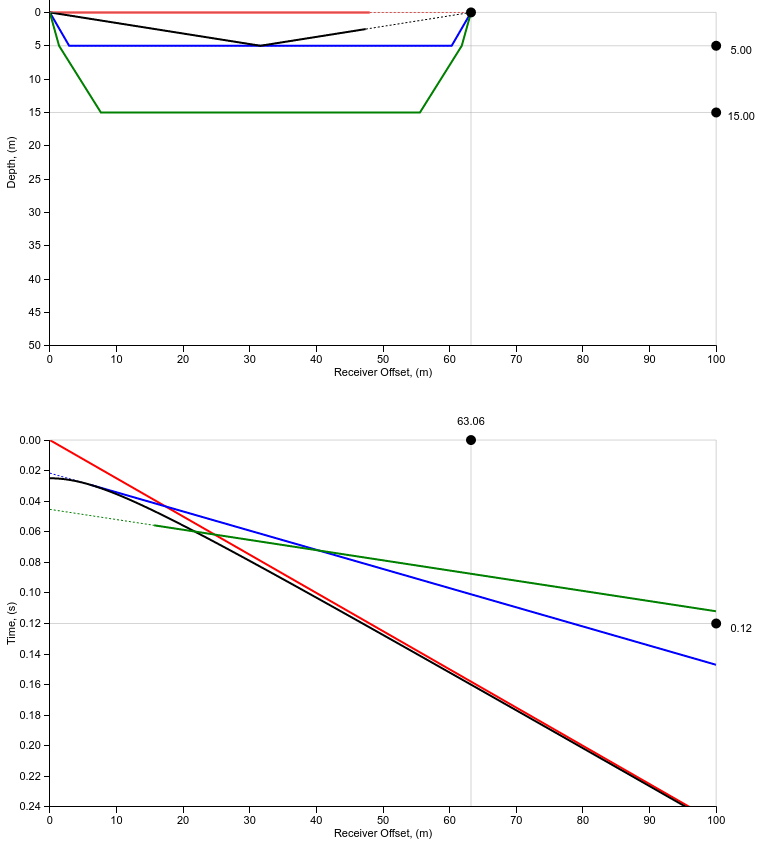

.. _seismic_apps:

Seismic apps
************

There are four seismic related apps used in this course. They are referenced throughout the seismic course material. They are collected here for reference:

1) `3pt Science seismic refraction app <https://www.3ptscience.com/app/SeismicRefraction>`__
2) `Seismic refraction survey notebook <http://mybinder.org/repo/ubcgif/gpgLabs/notebooks/Seismic/RefractionSurvey/SeisRefracSurvey.ipynb>`__
3) `Synthetic seismogram notebook <http://mybinder.org/repo/ubcgif/gpgLabs/notebooks/Seismic/SyntheticSeismogram/SyntheticSeismogram.ipynb>`__
4) `Normal moveout notebook <http://mybinder.org/repo/ubcgif/gpgLabs/notebooks/Seismic/NMO/SeismicNMOapp.ipynb>`__

Apps 2-4 are Jupyter notebooks, which can be run live on the web using the binders platform. Each notebook has self-contained instructions. 

We also link to the seismic refraction app by `3pt Science <https://www.3ptscience.com>`__. It demonstrates seismic ray paths in a three layered earth. A snapshot of the app is shown below. It consists of two interactive plots, one showing direct, refracted, and reflected ray paths and the other showing travel-time vs receiver offest for those rays. The app allows you to explore how the different types of seismic ray paths depend on the structure (layer depth) and material properties (layer velocities) of the earth. 

Instructions for using the app are as follows: You can toggle the visibility of each ray using buttons on the left hand side of the page. Adjust the velocity of each layer using the controls on the right of the page and adjust the depth of each layer by dragging the horizontal sliders on the ray path plot. You can adjust the receiver offset by dragging the vertical slider on either plot. Finally, you can use the horizontal slider on the traveltime plot to explore how the rays progress as time advances. On the top plot, the path of each ray up to the time specified by the time slider are shown as thick solid lines. Thin dashed lines show how the rays will continue to propagate after the specified time. The traveltime vs offset plots for the refracted rays will be dashed for offsets at which the rays will arrive after the direct wave.

