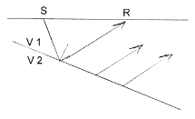
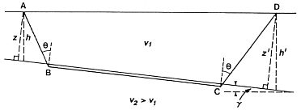
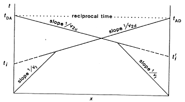

.. _seismic_refraction_dipping_layers:

Interpretation when layers are dipping
**************************************

Earth layers can often be approximated as planar, but they are rarely
horizontal.  The next level of complication is to assume that the layers have
some dip associated with them. Consider a single interface which is dipping at
an angle :math:`\theta` with respect to the horizontal. The critical angle is
still defined by the angle that an incoming wave must make with respect to the
**normal** of the refractor. This is shown by the diagram below.

.. figure:: ./images/dip_layer_S_R_schematic1.gif
	:align: center
	:scale: 135 %

.. figure:: ./images/dip_layer_x_t_lines.gif
	:figclass: center
	:align: center
	:scale: 123 %

Arrival times of the refracted wave will still appear as a straight line on
the travel time plot. However, as the refracted wave moves updip the waves
have less distance to travel to the surface. The travel time is reduced and
thus the slope of the line is reduced. The velocity recovered from using this
slope is called :math:`v_{2u}` , and is called the updip "apparent" velocity.
This will be larger than the true velocity of the layer.

Conversely, if you are downdip then the distance traveled by the refracted
wave increases with distance and it takes longer for the waves to reach you.
The slope of the refracted arrival on the travel time plot will increase and
the apparent downdip velocity :math:`v_{2d}` estimated from this slope will be
smaller than the true velocity.

.. figure:: ./images/dip_layer_x_t_lines2.gif
	:align: center
	:scale: 120 %

**Therefore, having receivers only updip or downdip from the source provides
only an apparent velocity and no indication that there is a dipping
interface.**

Intuitively, if we want to obtain another parameter (namely the dip angle,
designated :math:`\gamma`), then we need more data. We can achieve this by
having two shots so that both updip and downdip apparent velocities can be
obtained. This requires shots at both ends of the spread.

Consider the geometry and travel time curves shown to the right.  Note that
:math:`h` is depth (vertical distance) of the interface beneath the shot at A.
The distance from A to the normal of the interface is given by :math:`z`. These
quantities are given by :math:`(h', z')` for the source at D. The traveltimes
:math:`t_{AD}` (time for the wave to go from A to D) and :math:`t_{DA}` (the time
for the wave to go from D to A) are called the "reciprocal times."  It is
should be obvious from geometry that these time are equal.

Note the reciprocal travel times are sometimes erroneously considered as the
travel times from first to last geophones of a spread, even though these first
and last geophones do not always coincide with the two shot locations.
Reciprocal times are total travel times from source location to the last
receiver location.

Checking for equal reciprocal times is a common test of the quality of the
data. Don't forget that the reciprocal time for each shot is found as the
intersection of the refraction line with the time axis above the other shot
(not at the "arbitrary" time axis). Extending the line with a ruler is an
acceptable way of finding these times.

The traveltime for receivers in the downdip direction is

.. math::
	t_2 = \frac{x\sin(\theta + \gamma)}{v_1} + \frac{2z\cos\theta}{v_1} = \frac{x}{v_{2d}}+{t_i} \quad (1)

The traveltime in the updip direction is 

.. math::
	t^{\prime}_2 = \frac{x\sin(\theta-\gamma)}{v_1} + \frac{2z^{\prime}\cos\theta}{v_1} = \frac{x}{v_{2u}}+{t^{\prime}_i}   \quad (2)

So measurement of :math:`v_{2d}` and :math:`v_{2u}` can be used to obtain values for the critical angle :math:`\theta` and the dip :math:`\gamma`.

.. math::
	\frac{1}{v_{2d}} = \frac{sin(\theta + \gamma)}{v_1} \rightarrow \theta + \gamma = sin^{-1}\Big( \frac{v_1}{v_{2d}}\Big)

.. math::
	\frac{1}{v_{2u}} = \frac{sin(\theta - \gamma)}{v_1} \rightarrow \theta - \gamma = sin^{-1}\Big( \frac{v_1}{v_{2u}}\Big)

There are two equations in two unknowns :math:`\theta` and :math:`\gamma`,
therefore we can solve for both unknowns. The result of solving for
:math:`\theta` and :math:`\gamma` is

.. math::
	\gamma = \frac{1}{2} \bigg[ sin^{-1}\bigg( \frac{v_1}{v_{2d}} \bigg) - sin^{-1}\bigg( \frac{v_1}{v_{2u}}  \bigg) \bigg]

.. math::
	\theta = \frac{1}{2} \bigg[ sin^{-1}\bigg( \frac{v_1}{v_{2d}} \bigg) + sin^{-1}\bigg( \frac{v_1}{v_{2u}}  \bigg) \bigg]	

Now, how do we use these relations? Start by recalling what we want: We want
depths under each end of the survey line (:math:`h` and :math:`h'`) and two true
velocities. This is as much as we will obtain from a two-shot (forward and
reverse) seismic refraction survey. We have, or can measure, velocities
:math:`v_1`, :math:`v_{2u}`  and :math:`v_{2d}`  , and two intercept times :math:`t_i`
and :math:`t'_i`. The intercepts :math:`t_i` and :math:`t'_i` can be used to
calculate :math:`z` and :math:`z'` (using equations (1) and (2) above) because
:math:`x=0` when :math:`t_2=t_i` or :math:`t'_2=t'_i` and the angle :math:`\theta`
can be found using the three velocities obtainable from the T-X plot. Finally,
true depths :math:`h` and :math:`h'` can be found using these slant depths and the
relation we found for dip, :math:`\gamma` .

What about true refractor velocity, :math:`v_2` ? Snell's law can of course be
invoked. The critical angle :math:`\theta` (referred to above) is obtained from
the relation involving updip and downdip velocities, and the known value of
:math:`v_1` . A less accurate version of :math:`v_2` can be obtained by averaging
:math:`v_2d` and :math:`v_2u` but your average value will be wrong by a factor of
:math:`\cos(\gamma)` , or 2% to 3% for dips of about 12 degrees.

Profile Geometries
------------------

Because interfaces are generally dipping (if not curved and tortuous) one
needs to have information from multiple directions or at least some type of
overlapping information which can be manipulated to yield the dip. The most
common acquisition geometries are:

1. Reverse profile shots where you fire at both ends of the recording spread.

.. figure:: ./images/profile_geom1.gif
	:align: center
	:scale: 140 %

2. Split spread (receivers are spread out from the shot in both directions).

.. figure:: ./images/profile_geom2.gif
	:align: center
	:scale: 140%

3. Single end roll-along.

.. figure:: ./images/profile_geom3.gif
	:align: center
	:scale: 140 %

.. Notes to consider for review (Phil, 04/10/2014):
.. (1) The final sentence before Profile Geometries says averaging v2 and v2 (as does GPG). Quantities need clarification. 
