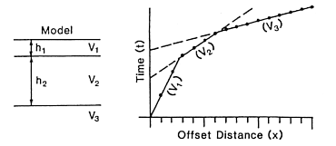
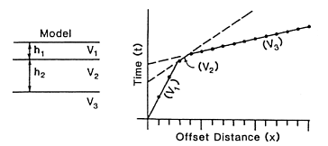
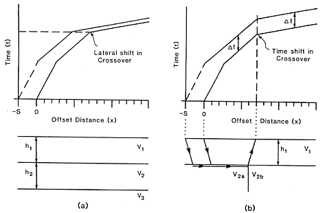

.. _seismic_refraction_other_topics:

Hidden Layers
=============

When acquiring refraction data we attempt to obtain first arrivals from each
refractor (in fact first arrivals are the only useful data - signal energy
following first arrivals can not be used unless seismic reflection is being
done - a topic covered in geop301). Sometimes it is not possible to obtain
refracted arrivals from each and every refracting horizon. There are two
reasons why the second layer might go undetected.

**1. The Second Layer is a Low Velocity Layer:**  If :math:`v_2 < v_1`  the
     incoming wave will refract towards the normal and there will be no critical
     refraction along the upper boundary.  Assuming :math:`v_3 > v_1` the first
     arrival travel time curve will look as shown in the second half of the
     figure.

.. figure:: ./images/low_velocity_schematic.gif
	:align: left
	:scale: 155 %

.. figure:: ./images/low_velocity_t_x_plot.gif
	:figclass: center
	:align: center
	:scale: 100 %

**2. The Second Layer is Too Thin:**  Even though there is a headwave on its
     upper surface, the headwave traveling along the top of the third layer
     arrives first. The dependence of the travel time curves upon the thickness
     of the second layer is shown in this sequence of three figures.

.. figure:: ./images/thin_layer_2.gif
	:align: center
	:scale: 120 %

Lateral Velocity Changes
========================

The headwave travels at the speed of the underlying medium and that velocity
might vary laterally. This produces another complication when interpreting the
first arrivals. Consider the two velocity models and traveltime curves given
below. The traveltime curves are the same. We note that the crossover point
between :math:`v_{2a}` and :math:`v_{2b}` in (b) is always shifted away from the
shotpoint with respect to the location of the position of the subsurface
change.

.. Labels for a and b need to be added to these figures.

.. figure:: ./images/lateral_velocity_a.gif
	:align: left
	:scale: 106 %

.. figure:: ./images/lateral_velocity_b.gif
	:align: center
	:scale: 110 %

To determine which structure is correct we need another shot. It could be a
reversed shot, or a shot that is off the end of the profile. If the shot is
offset then the travel times from the two velocities are shifted as indicated
below. In (a) the traveltime curve is shifted to the left by an amount
:math:`S`. In (b) a constant time increment is added to each arrival and the
location of the crossover remains the same.

Phantoming
==========

.. figure:: ./images/phantoming.gif
	:align: right
	:figclass: float-right-360
	:scale: 100 %
	
As shown in the above diagram, refracting arrivals from two shots from the
same end produce traveltime curves which are parallel. This provides a good
way to group first-break arrivals according to specific refractors. Ideally we
want to have many arrivals from a single interface. This can be accomplished
by using the parallelism noted above and phantoming the arrivals. That is, we
can determine the arrival time of the refracted event at a location where no
seismometer really existed. Phantoming can be carried out in the cases where:

    1. The receiver array is fixed, and off-end shots are recorded.
    2. The shot and receiver array is moved.

The diagram here shows an example where the spread is moved.

 1. For the shot at x-position 140 feet , data from the shot at 100 feet can fill in arrival times between positions 0 and 40 feet.

 2. For the shot at 100 feet, data from 140 can phantom in artificial arrivals that arrive before :math:`x_{crit}`. The data can help define the intercept time because we now have more points to help estimate a straight line. Note that these phantomed values don't actually exist but they are valid data for helping us estimate the slope and intercept for the particular refractor.

Static Data Corrections
=======================

There are two corrections that are sometimes applied to the recorded travel
times. These are corrections for elevations and similar corrections when there
is a known weathered layer which has variable velocity.

**Elevation Correction:** The goal is to reduce the data to a datum plane, that
is, to define a flat surface on which the data might have been recorded. The
importance of this lies in the fact that all of our interpretation formulae
assume that the upper surface of the earth is flat. Let :math:`h_S` and
:math:`h_D` respectively denote the height of the shot and receiver about the
datum plane (negative heights are allowed). The angle that the waves in this
region are travelling upward or downward is determined by Snell's law. If
:math:`v_n` denotes the velocity of the refractor then the elevation
correction is

.. math::
	t_{elev} = -(h_S + h_D)\frac{(v_n^2 - v_1^2)^\frac{1}{2}}{v_1v_n}