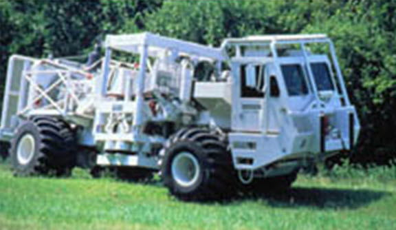
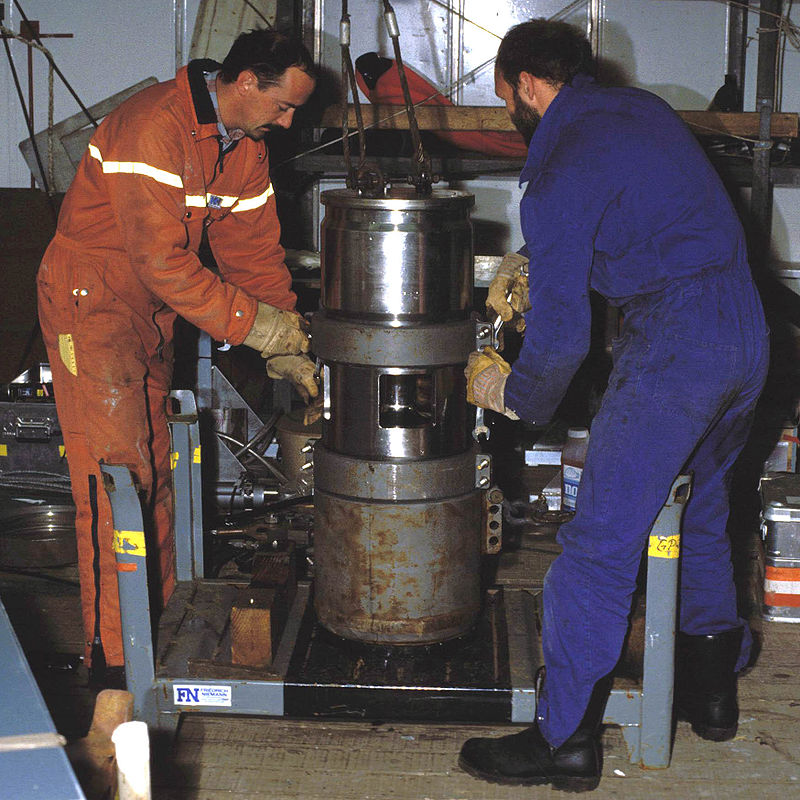

.. _seismic_sources:

Sources
***************

Elastic energy in the earth can be generated in many ways. These energy sources can be divided into two main categories. The first category, passive sources, such as earthquakes, create seismic energy by natural processes. Active, or artificial, sources use human produced energy. Earthquakes produce great quantities of energy but we can't control where they occur or characterize the nature of the energy released in sufficient detail for used in applied geophysics.

Some important considerations in the design of active sources are

1. High energy--the stronger the source, the better the signal to noise ratio.

2. Appropriate frequency content--Higher frequencies offer high resolution but decay more quickly than low frequency signals, lowering depth of investigation for a given source amplitude.

3. Repeatability--allows for stacking (repeating and averaging) measurements to improve the signal to noise ratio.

4. A well-defined source signature--By this we mean that the exact pattern of the wave energy created by the source should be known. If it is, we can use deconvolution to significantly enhance the imaging quality.

Land Sources
------------

There are many ways of generating elastic energy and transmitting it into the earth. Some standard source types are listed below

1. Explosives: To get good coupling the explosive should be detonated in a shallow shot hole. Explosives can cheaply generate large amounts of energy over a broad frequency range but they are not repeatable nor well defined and they may not be environmentally friendly.

2. The buffalo gun is another simply source type that is commonly used in small scale engineering / environmental work. It provides a controlled way to detonate a shotgun shell in a small hole augured into the ground. Buffalo gun shots are typically repeatable. The below figure shows a diagram of this type of source.

.. figure:: ./images/BuffaloGun.gif
    :align: center

    Diagram of a "Buffalo gun" seismic source. The 3/4 inch pipe with the shell installed is lowered into a borehole of the same size, then the steel drop rod is dropped through the tee so the firing pin strikes the 12 guage shell. This creates the seismic energy.

3. A simple heavy hammer on a baseplate is inexpensive and safe for small jobs. When shear waves are required, a baseplate with ribs that penetrate the ground is used, and it is struck on it's side. This is a simple way to produce shear waves.

4. Finally, vibroseis is a more expensive source used mainly for reflection surveying. The input is a frequency varying sinusoid (called a chirp signal). Multiple vibrators are often used. There are systems ranging in size from handheld units like pavement packers through to massive special purpose trucks that can be used singly or in coupled groups to produce signals that penetrate beneath the crust into the mantle of the Earth. Vibroseis sources provide excellent Repeatability and source characterization.

    `Vibroseis truck <https://upload.wikimedia.org/wikipedia/commons/a/ac/Vibroseis.jpg>`_. Licenced under `CC BY-SA 3.0`_.

Water Sources
-------------

When seismic surveying is needed to characterize ocean, lake or river bed sediments, special sources of seismic energy are required. A few of these are listed here:

1. Air gun: Compressed air is released to the water, forming a bubble. As the bubble rises to the surface it pulsates creating an extended source signature. See figure below for an airgun used in a large industrial survey and click `here <https://www.youtube.com/watch?v=IZzd7wDQbIU>`__ for a short video describing the principles of airgun operation.

    `Air gun <https://upload.wikimedia.org/wikipedia/commons/7/70/Air_gun_hg.jpg>`_ by `HannesGrobe <https://commons.wikimedia.org/wiki/User:Hgrobe>`_, licenced under `CC BY-SA 2.5`_.

2. Water gun: Water is ejected by a piston and there is a cavity behind the water jet. There is an implosion but no bubbles because no extra air has been introduced. Click `here <https://vimeo.com/70134132>`__ for a video of a water gun source in action.

3. Sparkers: The electric charge held on a large bank of capacitors is discharged directly into the water. This ionizes the water and creates a plasma pulse. Voltages of ~4kV, and currents of ~200A are involved.

4. Boomers: These involve the discharge of capacitors through a coil.  The changing voltage impinges upon an aluminum plate and the interaction of the magnetic fields drives the plate backward.

.. _CC BY-SA 3.0: https://creativecommons.org/licenses/by-sa/3.0/.

.. _CC BY-SA 2.5: http://creativecommons.org/licenses/by-sa/2.5
