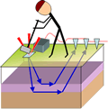

.. _seismic_survey_index:

Survey
==================

This section will examine some elements of seismic surveying that are common to the three classes of surveying: refraction, reflection and MASW.

Contents:

.. toctree::
   :maxdepth: 1

   seismic_sources
   seismic_receivers
 
   