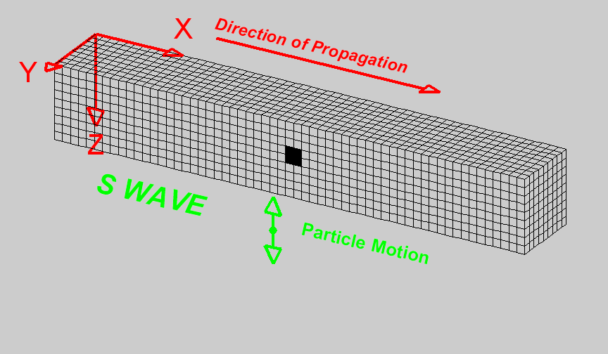
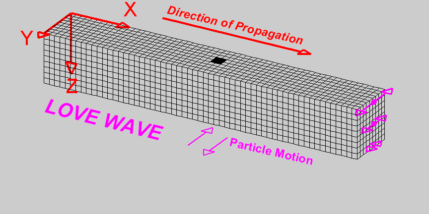
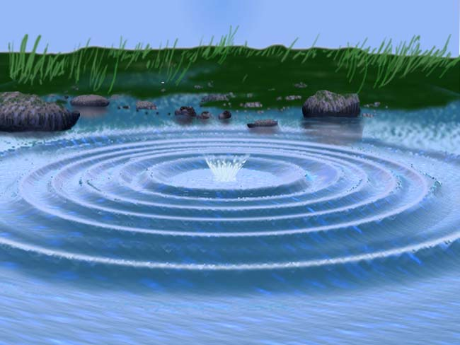

.. _wave_basics:

Basics of wave propagation
==========================

Elastic model for Earth rocks
--------------------------------

Recall from the :ref:`seismic velocity <seismic_velocity_duplicate>` page of the physical properties section that the earth deforms elastically when it is deformed by a source of seismic energy. These small elastic strains will propagate as waves away in all directions from the site of the original stress. The easiest way to obtain intuition about this is to think about rocks as being made up of a set of connected springs. Apply a force (stress) to any part and you will eventually get motion elsewhere. This propagation of energy is a type of wave motion. Elastic waves can be divided into two categories:

.. sidebar:: Elastic model for rocks

	.. figure:: ./images/springbox.png
		:align: center

1. **Body waves** which travel through materials

2. **Surface waves** which propagate along boundaries between materials such
   as the air/earth interface.

Subtypes of these two categories are described below. Each wave type travels through a given material with a velocity that depends upon the elastic properties and density of the material.

Body Waves
----------

**Compressional waves (P waves)** propagate by compression and rarefaction and
the velocity of such waves, :math:`v_p`, in a material with bulk modulus :math:`K`, shear modulus :math:`\mu`, and density :math:`\rho` is given by the equation

.. math::
	v_p = \sqrt{ \frac{K + 4/3\mu}{\rho} }.

The figure below shows a simple animation of the motion associated with P waves.

.. figure:: ./images/pwave-animated-2.gif
	:align: center

	Animation by `L. Braile`_, from his `seismic wave demo`_, licensed for non-commercial reuse.

**Shear waves (S waves)** propagate by a pure shear strain perpendicular to the
wave propagation. The propagation speed :math:`v_s` is given by

.. math ::
	v_s = \sqrt{\frac{\mu}{\rho} }.

The below animation shows the propagation of a vertically polarized S wave. Note that an S wave could also be horizontally polarized, meaning that particle motion would be in the y direction in the coordinate system of the animation, as opposed to the z direction for vertical polarization.

	Animation by `L. Braile`_, from his `seismic wave demo`_, licensed for non-commercial reuse.

Note that if :math:`\mu = 0` then :math:`v_s = 0`. This tells us that shear
waves do not travel in a liquid.

Seismic reflection and refraction surveying is usually carried out by the analysis of P waves. S-waves can also be used but they are harder to generate artificially compared to P-waves and require more complex receivers than ones designed to measure just P-waves. In marine surveys (unless sources and receivers are coupled directly to the ocean bottom) it is not possible to generate or measure S-waves at all. However, since :math:`v_s < v_p`, there are situations where it is beneficial to
use S-waves instead of P-waves.

Surface Waves
-------------

**Rayleigh waves** propagate along a free surface or on the boundary between two
materials. Particle motion is a retrograde ellipse, and in the same plane as
wave energy propagation. The amplitude of particle motion decays
exponentially with depth. Rayleigh wave speed :math:`v_R < v_S`. Large
earthquakes can generate Rayleigh waves that circumnavigate the globe. This
provides information about the velocity structure in the upper few hundred
kilometers of the earth.

.. figure:: ./images/Rayleigh-wave-animated.gif
	:align: center

	Animation by `L. Braile`_, from his `seismic wave demo`_, licensed for non-commercial reuse.

**Love waves** exist in a surface layer when the shear wave velocity of the
upper layer is less than the shear wave velocity of the lower layer. The
waves are trapped in the upper layer and the particle motion is parallel to
the free surface and perpendicular to the direction of propagation.

.. math::
	v_{S1} < v_{Love} < v_{S2}

	Animation by `L. Braile`_, from his `seismic wave demo`_, licensed for non-commercial reuse.

Both Love waves and Rayleigh waves are **dispersive**. That is, different
frequency components travel at different speeds. So the wave changes shape as
it travels. Also, the dispersion can be used to provide information about the
velocity structure in the upper region of the earth. For shallow work, it is
possible to generate surface waves artificially, and then observe the waves at
a series of locations at increasing distances from the source. This type of
field work is sometimes called **multi-channel analysis of surface waves** or
MASW. This is usually considered an "advanced" topic in applied geophysics.

Wave Velocity and Particle Velocity
-----------------------------------

Seismic waves typically travel in the ground at 2-7 km/s. This is the velocity
at which the energy moves, not the particles themselves. For comparison, sound
travels in air at approximately 0.33 km/s. The wave energy can be recorded
many kilometers from the source even if the source is small. The velocity and
displacements of individual particles in the rocks are however very small;
typical particle speeds are :math:`10^{-8}` m/s and typical ground
displacements are :math:`10^{-10}` m. For a list of velocities of some common
earth materials and a discussion of the geological factors that affect
velocities please see the :ref:`seismic velocity <seismic_velocity_duplicate>` page on the physical properties
section of this site.

Waves and Rays
--------------

A wave is a representation of the propagation of energy. In the case of seismic waves, energy is propagated through small displacements of the earth away from equilibrium. Energy propagates away from seismic source with a distinct pattern. Most seismic sources can be approximated spatially as point sources. In a uniform medium, energy propagates away from a point source in an expanding spherical pattern, much like ripples on a pond that's been disturbed. The figure below shows a snapshot of waves on a pond. Notice how each ring forms a coherent surface where the water is disturbed from equilibrium by an equal amount. These rings propagate outward in time, in a coherent manner.

        
        Image reproduced with permission from The website of the `Gemini Observatory <http://www.gemini.edu/>`__. The original can be found `here <http://www.gemini.edu/images/stories/press_release/pr2003-2/pondwaves-noleaves.jpg>`__.

A wavefront indicates the set of locations at which the phase of the wave has the same value. To continue with the pond example, visualize the peaks (or troughs) of water ripples after a rock has been thrown in. The direction of propagation of the energy is normal to the wavefront. **Seismic rays** are imaginary lines perpendicular to the wavefront that indicate the path along which the wavefront is traveling. Rays are not physical entities. They exist only to illustrate where the energy travels. It is important to remark here that the arrival of energy at a geophone is not a point event. The energy is spread in space and time. Note how the peaks and troughs of the waves on the pond have widths, which remains constant as they propagate. Similarly, seismic energy will arrive at a geophone as a pulse of energy with some shape and width, not as a spike occurring a single instance in time. This pulse of energy is called a wavelet.

.. figure:: ./images/wavefront.gif
	:align: center

Lets illustrate the connection between wavefronts and rays using a seismic example. Have a look at the following animation.

.. raw:: html

    

    <iframe width="560" height="315" src="https://www.youtube.com/embed/0z2WTLLKjGY?rel=0" frameborder="0" allowfullscreen>
    </iframe>
    
 

The color represents a propagating wavefront due to a point source and the arrows are rays showing the direction of propagation. Note how the rays represent how the wavefront is bent when it hits the interface between two layers in the earth. They are always normal to the wavefront.

It is common in seismic processing and interpretation to represent waves as plane waves, that is, waves whose wavefronts are straight lines rather than circles. The wavefronts maintain a circular shape when propagating in a uniform medium but as they expand away from the source the circles get larger and larger, to the point where the curvature is negligible and they can be approximated as planes. this is illustrated in the figure below
	
.. figure:: ./images/Sonar_Principle_EN-modified-from-wikipedia-radar-article.svg.png
        :align: center
        
        Adapted from `Wikipedia <https://commons.wikimedia.org/wiki/File:Sonar_Principle_EN.svg>`__, licensed under `CC BY 3.0`_.

Attenuation
-----------

The amplitude of seismic waves falls off with distance from the source. There
are two primary reasons:

1. Geometrical spreading - that is, energy falls off as :math:`1/r^2` and hence the amplitude falls of as :math:`1/r`.

2. Earth materials are not perfectly elastic. Some frictional heating occurs
   as the waves propagate through the earth. This is often described as
   "absorption" and the absorption coefficient expresses the proportion of energy
   lost as the wave travels a distance of one wavelength. The figure here shows
   the progressive change of shape of an original spike pulse during its
   propagation through the ground due to the effects of absorption (after Anstey
   1977.) The spike's shape changes as well as experiencing reduced amplitude.
   This is because the different frequencies making up the pulse decay at
   different rates - in fact, higher frequencies decay more rapidly than lower
   frequencies. This is easily observed on earthquake signals that have been
   recorded at different locations. As noted above in the context of surface
   waves, such frequency dependent behavior is called **dispersion**.

.. figure:: ./images/attenuation.gif
	:align: center
	

.. _CC BY 3.0: https://creativecommons.org/licenses/by/3.0/
.. _Subsurface Wiki: http://subsurfwiki.org/
.. _L. Braile: http://web.ics.purdue.edu/~braile/
.. _seismic wave demo: http://web.ics.purdue.edu/~braile/edumod/waves/WaveDemo.htm
