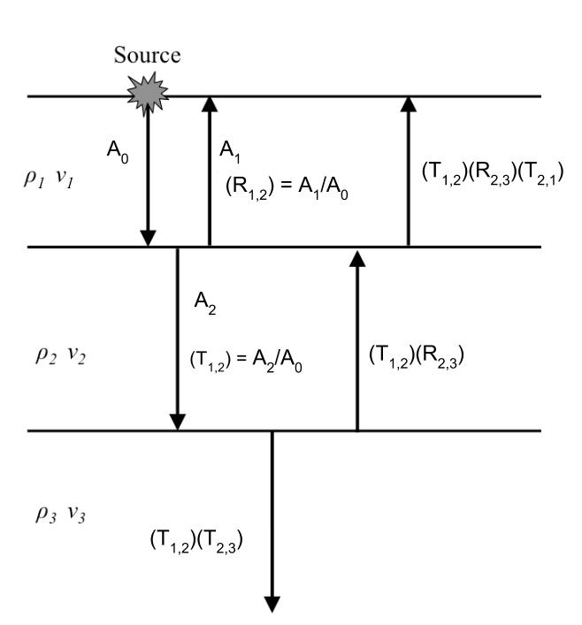
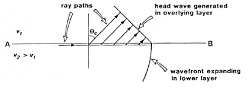

.. _waves_at_interfaces:

Waves at interfaces
===================

Reflection and transmission of plane waves
------------------------------------------

When a wave strikes an interface between two materials with differing physical properties, some of the wave energy will be reflected and the rest will be transmitted through or along the interface. All of the processing and interpretation methods we will discuss will assume that a seismic wave striking the interface between materials of differing physical properties can be approximated as a plane wave. We define a new quantity called acoustic impedance as :math:`Z = \rho V`, the product of density and velocity. The velocity in question could be for either P or S waves.

Let us first consider waves striking an interface at normal incidence, i.e. with the direction of propagation perpendicular to the interface. The relative amplitudes of the reflected and transmitted waves will depend on the acoustic impedances of the two materials. Let :math:`A_0`, :math:`A_1` and :math:`A_2` be the amplitudes of the incident, reflected, and transmitted waves, respectively. The ratios of :math:`A_1` and :math:`A_2` to :math:`A_0` are given by the reflection and transmission coefficients:

**Reflection Coefficient:**

.. math::
    R = \frac{A_1}{A_0} = \frac{Z_2 - Z_1}{Z_2 + Z_1} \qquad -1 \le R \le 1

**Transmission Coefficient:**

.. math::
    T = \frac{A_2}{A_0} = \frac{2 Z_1}{Z_2 + Z_1} \qquad 0 \le T \le 2

The following figure shows the progression of amplitude as a vertical seismic wave propagates through the earth.

Displacement of the earth from equilibrium position must be continuous across any interface. This guarantees that :math:`A_0 = A_1 + A_2`. We make note of the values of :math:`R` and :math:`Z` in some important special cases:

1. If :math:`Z_1 = Z_2`:   :math:`R = 0`,  :math:`T = 1`

2. If   :math:`Z_1 >> Z_2`:   :math:`R = -1`,  :math:`T = 2`.  The value :math:`R
   = -1` means that the pulse will be reflected with a polarity change, for
   example at the rock-air interface, with an upward traveling wave.

3. If   :math:`Z_2 >> Z_1`   :math:`R = 1`,  :math:`T = 0` (wave travelling down through the air and hitting the air earth interface).

We can illustrate scenarios two and three using the example of a wave propagating on a string. A string with a free end represents scenario two and a string with a fixed end represents scenario three.  These are illustrated in the following video

.. raw:: html

    

    <iframe width="560" height="315" src="https://www.youtube.com/embed/9OpL3OFuVXo?rel=0" frameborder="0" allowfullscreen></iframe allowfullscreen>
    </iframe>
    

You can explore the concept further using an interactive web app `here <https://phet.colorado.edu/en/simulations/wave-on-a-string>`__.

**Remark:**  Large amplitudes of the transmitted wave are sometimes counter-
intuitive. However, the energy transported in an acoustic wave is

.. math::
    \text{Energy} = \frac{1}{2} \rho v \omega^2 A^2 \approx ZA^2

So even though there is an enhanced amplitude of a transmitted wave in certain
situations, there is still conservation of energy. The ratio of incoming to reflected
energy is :math:`E_R` and the ratio of incoming to transmitted energy is :math:`E_T`. In terms of the impedances on either side of the interface, The energy ratios are

.. math::
    E_R = Z_1 \left( \frac{Z_2 - Z_1}{Z_2 + Z_1} \right)^2 A_0^2

.. math::
    E_T = Z_2 \frac{4 Z_1 Z_1}{(Z_2 + Z_1 )^2} A_0^2

.. math::
    E_R + E_T = Z_1 A_0^2

Mode Conversion
---------------

A P-wave incident on an interface at a non-perpendicular angle will produce reflected and transmitted
S-waves, as well as P-waves. Analogous conversions occur when there is an incident S wave on a plane boundary. The
mode conversions (P :math:`\rightarrow` S, or S :math:`\rightarrow` P) can complicate interpretation, but S-waves are always slower than P-waves, so first arrivals will always be P-waves unless a special S-wave energy source is used. Interpretation of shear waves is still important in some contexts, especially in geotechnical applications, since they provide important information about the rigidity of the material.

.. figure:: ./images/modeconversion.gif
	:align: center

In seismic refraction surveying we are concerned with first arrivals and will not consider mode conversion further. It will be discussed again in the section on processing reflection survey data.

Angles of reflection and refraction
-----------------------------------
Consider a P-wave which is incident at an  angle :math:`\theta_1` measured with
respect to the normal of the interface, as seen in the figure below where the approaching wave is represented as a ray. The angles of the reflected and refracted rays are as follows:

**Law of reflection:** The angle of reflection equals the angle of incidence. So
:math:`\theta_r` = :math:`\theta_1` .

**Law of refraction:** The angle of refraction :math:`\theta_2`  is determined
through Snell's Law, which is

.. math::
	\frac{\sin\theta_1}{v_1} = \frac{\sin\theta_2}{v_2}

If the wave travels from a low velocity medium to a high velocity medium the
wave gets refracted away from the normal. Conversely, it gets refracted toward
the normal if the wave goes from a high velocity to a low velocity medium.

.. figure:: ./images/snell.gif
	:align: center

The animation of wavefront propagation shown earlier (and directly below) is again useful here. Although we have described Snell's law in terms of two rays it captures the bending of a spatially extended wavefront, as the animation clearly shows.

.. raw:: html

    

    <iframe width="560" height="315" src="https://www.youtube.com/embed/0z2WTLLKjGY?rel=0" frameborder="0" allowfullscreen>
    </iframe>
    

Critical angle
--------------

The critical refraction angle, called :math:`\theta_c`, is a key concept in refraction seismology. This is the angle of incidence for which the corresponding angle of refraction is :math:`90^{\circ}`. In this case, the refracted ray travels horizontally along the interface. A formula for the critical angle can be derived from Snell's law as follows:

.. math::
	\frac{\sin\theta_c}{v_1} = \frac{\sin 90^{\circ}}{v_2} = \frac{1}{v_2}

	\sin\theta_c = \frac{v_1}{v_2}

When the wave in the second medium is critically refracted, it travels
parallel to the interface at a speed of :math:`v_2`. As it travels, it radiates
energy into the upper medium with the associated ray path making an angle
:math:`\theta_c` with the normal. This critically refracted wave is also called
a "head wave". It is somewhat analogous to the bow wave of a moving boat. This is illustrated in the static figure below.

The following video from `the IRIS group <https://www.iris.edu/hq/programs/epo>`__ illustrates the propagation of reflected, sub-critically refracted and critically refracted rays.

.. raw:: html

    

    <iframe width="560" height="315" src="https://www.youtube.com/embed/FygYDmm99SA?rel=0" frameborder="0" allowfullscreen></iframe>
    </iframe>
    

We will also once again return to our trusty wavefront animation which shows the head wave in actual wave form, rather than just the head-rays

 .. raw:: html

    

    <iframe width="560" height="315" src="https://www.youtube.com/embed/0z2WTLLKjGY?rel=0" frameborder="0" allowfullscreen>
    </iframe>
    

A final very important point here is to note that energy will only be refracted back toward the surface if the velocity in the lower layer is greater than in the upper layer. Otherwise the ray will be bent toward the vertical downward direction. Examine Snell's law to convince yourself this is true. This scenario is illustrated below

.. raw:: html

    

    <iframe width="560" height="315" src="https://www.youtube.com/embed/eI3epl0ek3g?rel=0" frameborder="0" allowfullscreen>
    </iframe>
    

